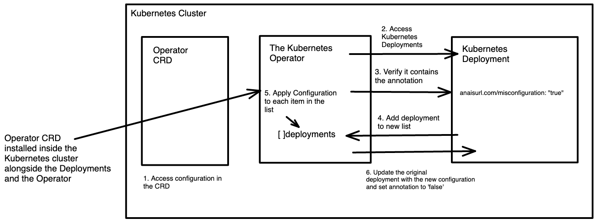

# Misconfiguration Operator for Security Chaos Engineering

## Description

This controller introduces misconfiguration into Kubernetes deployments to test how well your security tooling and processes respond to misconfiguration.

**Philosophy**
Usually, we are waiting around until misconfiguration are introduced into our environments by accident. By using this Misconfiguration Operator, we can intentionally test misconfiguration.
If we test intentionally, we already know
- what went wrong &
- how to fix it

This allows us to build a response pipeline in theory, which is then tested in practice.
Resulting, we can then analyse whether the real response matches our expected response and
- improve our security tooling and processes
- remove unknows and guessing

## Usage Guide
To use the Operator, follow these steps.

**Prerequisites:**
- Access to a Kubernetes cluster, any Kubernetes cluster should work.

**Install the Operator:**

1. Clone the GitHub repository:

```sh
git clone https://github.com/AnaisUrlichs/security-controller
```

2.  Deploy the controller to the cluster::

```sh
make install
```

Note that this will use the controller image specified in the Makefile.

**Create a Custom Resource**

The Custom Resources is required to define what changes the Operator should take on your deployments. The template looks as follows:
```
apiVersion: api.core.anaisurl.com/v1alpha1
kind: Configuration
metadata:
  name: configuration-sample
spec:
  containerPort: 60
  imageTag: "latest"
  limits: 400
  readOnlyRootFilesystem: false
  requests: 300
  runAsNonRoot: false
  memoryrequests: 80
  memorylimits: 130
```

Modify the template based on the changes that you would like the Operator to make on your deployments. 

Next, apply the Custom Resource to your cluster
```
kubectl apply -f custom-resource.yaml
```

**Set your Deployemnts**

Deployments will only be changed by the Operator if the following annotation is set in the deployment.yaml manifest:
```
metadata:
    annotations:
        anaisurl.com/misconfiguration: "true"
```

The deployment will be changed by the operator once per day for as long as it is running inside the Kubernetes cluster and the deployment has the annotation.

Otherwise, the reconcilation loop will run if either of the following is true:
1. A new Operator CRD with misconfiguration is deployed to the Kubernetes cluster and the same namespace contains a deployment with the Operator annotation is set to "true".
2. A new Deployment is applied to the cluster and the Operator annotation is set to "true".

### Uninstall CRDs
To delete the CRDs from the cluster:

```sh
make uninstall
```

### Undeploy controller
UnDeploy the controller from the cluster:

```sh
make undeploy
```

## Operator Design



Once the Kubernetes Operator is installed inside the Kubernetes cluster, it will go through the following steps:

1. Check whether it can find an Operator CRD that tells it which modifications to make on the Kubernetes Deployment. If it is not provided with a CRD, it will not look for a Kubernetes Deployment as it does not know which misconfiguration to apply.
2. Access all Deployments through the Kubernetes API that are running inside the cluster.
3. Check which Deployments contain the annotation needed to make modifications. If no Kubernetes Deployments are identified, the Operator will not apply the misconfigurations specified in the Operator CRD to any Deployment.
4. If the Operator identifies Deployments that contain the annotation, it will add them to a separate list of Deployments.
5. If the list is not empty, the Operator will iterate through the new list of Deployments and make modifications to each Deployment in accordance with the misconfiguration provided in the Operator CRD.
6. Lastly, it will set the value of ‘anaisurl.com/misconfiguration’ to false. This will prevent the Operator controller loop from trying to access the same Deployment again. The Operator CRD might be modified, which does not mean that the Operator should apply the new misconfiguration to the Deployment that has already been changed.


## Contributing

At this stage, I do not accept any contributions to this project as this is created as part of my Bachelor Thesis.

### How it works
This project aims to follow the Kubernetes [Operator pattern](https://kubernetes.io/docs/concepts/extend-kubernetes/operator/).

It uses [Controllers](https://kubernetes.io/docs/concepts/architecture/controller/),
which provide a reconcile function responsible for synchronizing resources until the desired state is reached on the cluster.

### Test It Out
1. Install the CRDs into the cluster:

```sh
make deploy
```

2. Run your controller (this will run in the foreground, so switch to a new terminal if you want to leave it running):

```sh
make run
```

**NOTE:** You can also run this in one step by running: `make install run`

### Modifying the API definitions
If you are editing the API definitions, generate the manifests such as CRs or CRDs using:

```sh
make manifests
```

**NOTE:** Run `make --help` for more information on all potential `make` targets

More information can be found via the [Kubebuilder Documentation](https://book.kubebuilder.io/introduction.html)

## Build and Push a new container image of the Kubernetes Operator

3. Build and push your image to the location specified by `IMG`:

```sh
make docker-buildx
```

## License

Copyright 2023 AnaisUrlichs.

Licensed under the Apache License, Version 2.0 (the "License");
you may not use this file except in compliance with the License.
You may obtain a copy of the License at

    http://www.apache.org/licenses/LICENSE-2.0

Unless required by applicable law or agreed to in writing, software
distributed under the License is distributed on an "AS IS" BASIS,
WITHOUT WARRANTIES OR CONDITIONS OF ANY KIND, either express or implied.
See the License for the specific language governing permissions and
limitations under the License.

